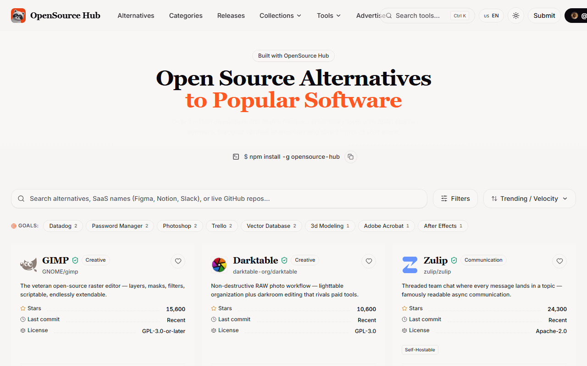
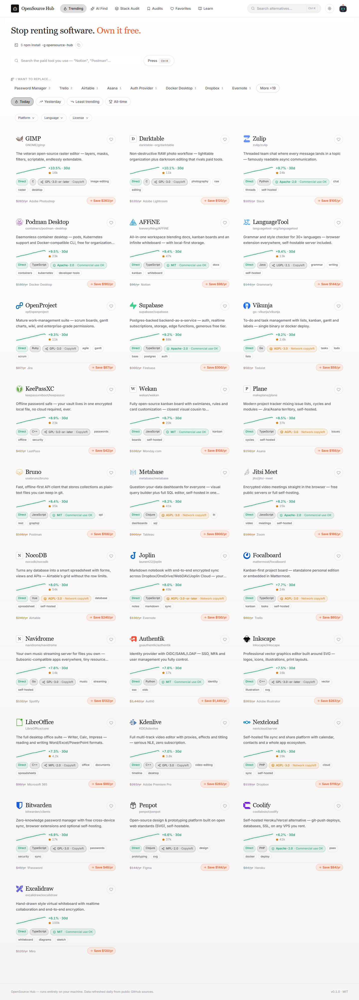

# ◆ OpenSource Hub

[](https://github.com/bengowtham70-dev/opensource-hub/actions/workflows/tests.yml)
[](https://bengowtham70-dev.github.io/opensource-hub)
[](https://github.com/bengowtham70-dev/opensource-hub/actions/workflows/tests.yml)
[](https://github.com/bengowtham70-dev/opensource-hub/actions/workflows/tests.yml)
[](https://render.com/deploy?repo=https://github.com/bengowtham70-dev/opensource-hub)


**Find free open-source alternatives to the paid software you already use. Trust what you download. One command, local dashboard, zero accounts.**

🌐 **Live Directory:** [https://bengowtham70-dev.github.io/opensource-hub](https://bengowtham70-dev.github.io/opensource-hub)

```bash
npm install -g opensource-hub
opensource-hub
```

<p align="center">
  
</p>
<p align="center">
  
</p>

A local dashboard opens in your browser with:

- **💸 Alternative finder** — search the paid tool you use (Notion, Postman, Figma…) and get a vetted free alternative with honest annual savings and a feature-parity checklist
- **🛡️ Trust Scores** — 9-signal composite (commit recency, bus factor, license clarity, OpenSSF Scorecard via deps.dev…) with plain-language red flags and a one-click **"Dispute this score"** appeal
- **🔥 Trending views** — today / yesterday / least-trending / all-time, from daily star snapshots with 30-day sparklines
- **⚡ One-click downloads** — repos shipping installers get a Run App button with a live progress ring + sha256 verification; source-only repos say so honestly
- **🧭 AI Tool Finder** — describe the job in plain language, get a reasoned shortlist (bring your own API key, stored only in your browser; works keyless via offline matching)
- **📋 Stack Audit** — paste your team's paid-software stack → alternatives, licenses and total yearly savings across all of it, exportable as CSV
- **🔔 Watchlist alerts** — watch a tool; get a local alert if its trust score drops
- **💬 Community** — works-for-me votes, crowd tags, saved trust audits with CSV export, GitHub Discussions comments
- **📰 Release notes** — every tool's latest releases, rendered in-app
- **❤️ Favorites + Export/Import** — your data stays yours: one JSON file moves it between machines
- **📚 Learn** — plain-language primers on open source, GitHub, licenses and build steps

## Requirements

- [Node.js](https://nodejs.org) 18 or newer

## Uninstall

```bash
npm uninstall -g opensource-hub
```

## Troubleshooting

**macOS/Linux `EACCES` on install** — make npm own its global folder:
`mkdir -p ~/.npm-global && npm config set prefix ~/.npm-global`, add `~/.npm-global/bin` to PATH.

**Windows "not recognized"** — run `npm config get prefix` and add that folder to PATH, then reopen your terminal.

**Port already in use** — nothing to do; the app picks the next free port automatically.

Your data (favorites, votes, watchlist, audits) lives locally in:
- Windows: `%LOCALAPPDATA%\opensource-hub`
- macOS: `~/Library/Application Support/opensource-hub`
- Linux: `~/.config/opensource-hub`

## How it works

The CLI starts a tiny local server (`localhost:3000` with auto port-fallback, bound to your machine only) and opens your browser. Trending data comes from static snapshots built daily by a free GitHub Actions cron (`.github/workflows/snapshot.yml`); live repo details, contributor counts, OpenSSF Scorecards and release feeds are fetched directly from GitHub/deps.dev **from your machine** with ETag caching — re-polls cost zero rate-limit quota, and when rate-limited the UI silently serves cached data with a "Cached" badge. Security advisories come from the keyless OSV.dev batch API. Comments run on GitHub Discussions via giscus. No central server exists — nothing of yours to secure, nothing of ours to leak.

## Development

```bash
npm install
npm run dev:server   # API server on :3000 (no browser auto-open)
npm run dev          # Vite dev server on :5173 (proxies /api)
npm run build        # build dashboard → dist/client
npm test             # server + schema + trust + security + metrics tests (node:test)
npm run test:client  # client unit tests (vitest)
```

CI runs the full suite on Ubuntu, macOS and Windows on every push (`.github/workflows/tests.yml`).
Tagging a `v*` release builds standalone binaries for all three OSes (Bun compile) plus the npm
publish (`.github/workflows/release.yml`).

## Legal

Comparisons are community-reported, not guaranteed. See `legal/` for Terms and Privacy drafts.
Trademarks belong to their owners; references are nominative.

## License

MIT
